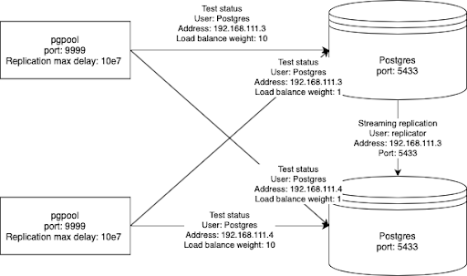

# Pgpool-II
Its task is to provide abstraction layer over database. Provide load balancing and master detection. Can't properly serves Bucardo, so as proxy is not perfect - keep it in mind.

## Configuration
Important configuration files: 
- `pool_hba.conf` file. Format is the same as for the `pg_hba.conf` (`PostgreSQL`) file. It controls connections, which are allowed to connect with pgpool. Be careful - if ciphering is used like md5 or AES for sending passwords, then connection between pgpool and postgres must have the same (md5 or AES) or trust. AES (pgpool <-> postgres) and md5 (client <-> pgpool) is not possible (and vice versa). To include it during running, must be specified as an option.
- `pool_passwd` - here are fold pairs user:password. Passwords have a specific format - in short for plain text, it must have prefix TEXT, etc for other formats. Again, if verification is in md5, password must be stored as md5 of plain text - not AES. To be included in run, must in the same folder like configuration (`pgpool.conf`)
- `pgpool.conf` - Pgpool config file. Be careful during upgrades - it is for version 4.0.x. Wouldn’t work for sure with 4.2.x (checked)

## Operation
On nodes is system service called `pgpool`. To check status - `systemctl status pgpool`. Supports `start`, `stop`, `restart`.

## Monitoring parameters
Every `pgpool` instance is connected to both databases on given side. It should load balance selects in propotion 10:1 in favour local database instance. 
Parameters:
- `replication_delay_B` - amount of delay in master - standby replication of instance
- `select_cnt` - number of selects executed on given database
- `Status` - status of connection with given database

## Problems 
Pgpool don't try to reconnect after failure of connection with node - it needs to restart. So after database short pause, you probably need to restart Pgpool to enable work.

## Instalation

Take a look on ansible receipes here: https://gitlab.cern.ch/rmucha/ccdb_postgres_ansible

### Dependencies

- libpq-dev

## Example of connection schemes

[back](readme.md)
